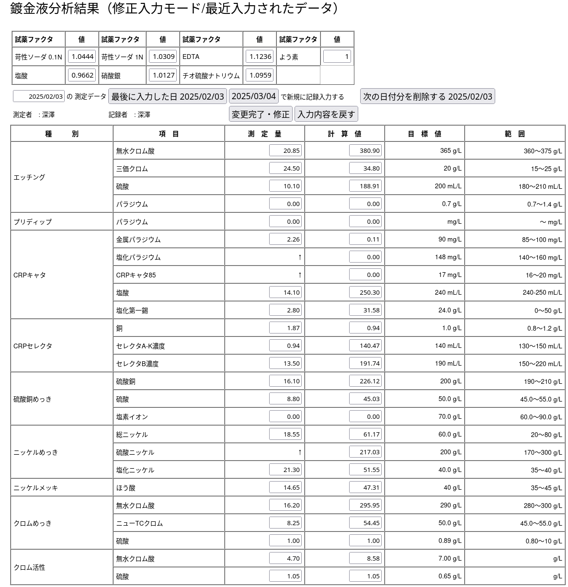

# 職務経歴書

## 本人情報

* 氏名：　彦坂　総太郎
* Name:  Sotaro Hikosaka
* 居住地: 川崎市高津区（溝の口）
* 最終学歴: 東京都立小平高等学校
* 資格：　普通自動車免許(中型8t限定)
      ：　潜水士( 1993年取得 )

##　職務経歴

* 1991/4 武蔵電算(派遣)： 派遣先：マツダ株式会社東京本社飯田橋計算センター
* 1993/3 同・退社
* 1993/4 有限会社め組：　直接雇用：事務関連処理・受託業務・潜水士業務ほか
* 1996〜1999 檜伸図書株式会社/w-ing.or.jp のインフラ管理受託
* 2001/2 同・退社
* 2001/3〜現在 有限会社クルー：直接雇用：受託システム開発・監理・インフラ管理

## 技術スタック
* shell/awk/perl 
* javascript  3年〜
* [php](./php.md)         10年〜
* python      2年〜3年
* ruby        1年 以下
* [VB6.x](./vb6.md)       〜 5年
* VB.Net      〜 3年

## 特性・スキル
* [ロードバイク](./roadbike.md)で移動できる。
* [音楽](./cello.md)もわかる。
* 手当たりしだいに何でも[読む](./bookworm.md)。広く浅く。

## 初期の知見
* 汎用機オペレータを経験。
* 個人的には 8bit PC(MC6809) アセンブラでカンタンなものを書くことからスタート
* 1986年　[OS/9](./os-9.md)(6809) に触れる機会を得る。
* 1990年 Linux1.0 をインストールし、UUCPを利用して勤務先とつなげる。
* SunOS4.x/HP-UX11 のある現場でのオペレーション業務従事。

##　主な業績

* [ISP事業運営への参画](./w-ing.md)
* [有限会社クルー創業時の参画](./crew.md)
* [京浜島の鍍金工業団地でのLAN](./cmk.md)
* [Access2000/取引先企業へのツール作成](./access.md)
* [Linux普及初期における運用](./slackware.md)
* [FreeBSDによる完全移行](./freebsd.md)
* [IPSec/VPN 相互運用](./ipsec.md)
* [qmailメールシステム運用](./qmail.md)
* [postfixメールシステム運用](./postfix.md)
* [DNS/djbdns](./djbdns.md)
* [DNS/powerdns](./powerdns.md)
* [広告代理店のWebシステム管理](./freebsd-php.md)
* [広告代理店・WebシステムバックエンドDB管理](./firebird.md)

## 現況

* Linux 現在は　Ubuntu　を日常業務で活用。
* デスクトップ環境としてGhostBSD(FreeBSD)、macBookAir(macOS)も日々活用。
* [P2V: Windows95](./win95.md) で動くFAシステムに対するサポート。Windows10 PCの上のVirtualBoxで Windows95を稼働させ、ソフトウェア資産の減耗に対するケアを提供。
* Apple/macOS: iPhoneアプリ開発のため取得。iPhoneのMDM管理などに利用。
* FreeBSD/OS 管理全般 (インストールサーバ数 33台/ OSコンテナ含む160程度を管理）
* samba/openldap/radius/nagios/zabbix/postfix　の 保守管理（ローカルなコードカスタマイズ含む）
* VPN/DNS の知識を活用した様々な提案と運用環境の実現・運用サポート
* WindowsPCの日常管理サポート・提携先ソフトウェア事業のサポート（DB運用など）
* TeamViewer/VNC/RDP を駆使してリモートでのエンドユーザサポート

## サンプルなど
* nodejs/expressjs を使用した小規模システム開発

## 現在進めているもの

* 「負の遺産」清算と効率化
* 製造現場での問題可視化
* raspberry-pi の 活用
* OS管理の自動化 (特に FreeBSD / Ansible/railsの構成)
* LLM([llama.cpp](https://qiita.com/search?sort=&q=user%3Astrnh+llama)/ollama の実用化に対する調査)
* Python/ES/tsx その他

## 就業条件

* 勤務形態: リモートをメイン：　出社・現地入構作業も可能

## その他

* 地球環境に優しい移動手段の自転車利用シフト
* ロードバイク趣味: <a href="https://www.strava.com/athletes/105395662">Strava</a>
